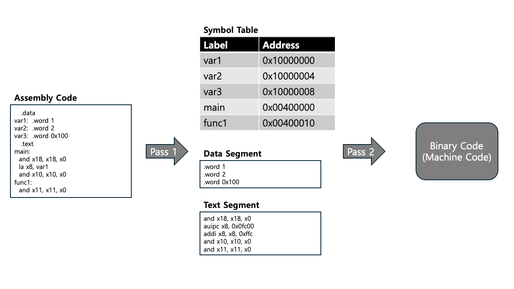

# Project #1: Implementing an RISC-V (RV32I) Assembler
This project is to implement an RISC-V (RV32I) ISA assembler, and the given code is a basic skeleton for input and output.

## Introductions
Basically, the code written in `assembler.c` operates only creation of files for input and output. Each student is required to implement parsing, converting, or any functions based on the skeleton code. The detailed instructions are described in `handout/Project_1.pdf`.

There are two directories for this project. The code will read a `.s` file from `sample_input` and it will produce `.o` file in the same directory. 

The files in `sample_output` are used when you test your output with them. The following is an example for the skeleton code:

```shell
# Usage
$ ./assembler sample_input/example1.s   # This will produce sample_input/example1.o

# Test
$ make test # This will test all examples in sample_output
```

## Description for Skeleton Code
The skeleton code we provided is part of a two-pass assembler. Basically, the two-pass assembler reads the assembly code twice and converts it to binary code (machine code).


*RISC-V Assembler processing example*

As shown in the figure above, the skeleton code takes an assembly code as an input. Then, in the 1st pass, you need to create a symbol table that specifies a key-value pair to map labels to memory addresses. Here, you are supposed to write code for` make_symbol_table()`. While you are building the symbol table, you may want to extract the `data` and `code` segments separately to simplify the 2nd pass.

In the 2nd pass, the skeleton code just reads the text segment and translates each line of code into binary (machine code). Here, you are supposed to fill out `make_binary_code()` code. While translating, you may encounter the labels. Now you can translate the labels to the memory addresses by referencing the symbol table you built in the 1st pass. 


## Hints
All students are supposed to implement the functions below.

1. __void make_symbol_table(FILE *input)__  
    This function makes a symbol table for converting assembly code to binary.
    This function should be able to parse the line and fill the symbol table. 
    Both data and text lines are added to their own segment.

2. __void make_binary_file(FILE *output)__  
    Make a binary file using the previously created symbol table. 
    You need to print binary lines to the `.o` file(=`FILE *output`) mentioned above.
    You can use `record_text_section()` and `record_data_section`. 
    These functions will print binary code converted from assembly code.
    
3. __void record_text_section(FILE *output)__  
    In this function, you need to translate a text segment line by line to binary code. 
    The binary codes should be printed into an output file.
    
4. __void record_data_section(FILE *output)__  
    Likewise text section, this function translates the data segment to binary code.
    It converts their initialized values to binary code and prints them into an output file.

The code that needs to be implemented is written as `/* blank */` with short comments. If you do not want to use the skeleton code, it is allowed to write code from scratch.
Functions you need to implement are all located in `assembler.c` (***You should only modify `assembler.c` file***). Also, we provide some utility functions, so feel free to use them (See `util.c` to check these functions).

## Debug
We have a debug option. It is located in `assembler.h` header file. If you want to enable the debug option, define macro `DEBUG` as `1`.
If you want to disable, define macro `DEBUG` as `0`. We hope this option helps you understand the code flow.

## Reference functions
Description of functions used in this project.
1. __FILE* tmpfile(void)__  
    Create a temporary file and return the file stream pointer.
    This function opens the temporary file in wb+ mode.
    
2. __void rewind(FILE *fp)__  
    Point back to the start of the file stream.
 
## Q & A
If you find any errors in this code or have a question, please leave it on [LMS](https://lms.korea.ac.kr/).
